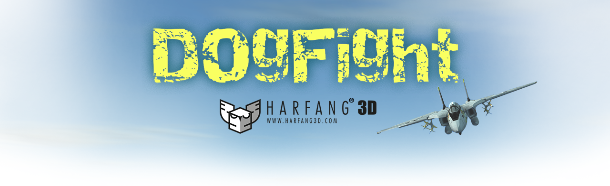
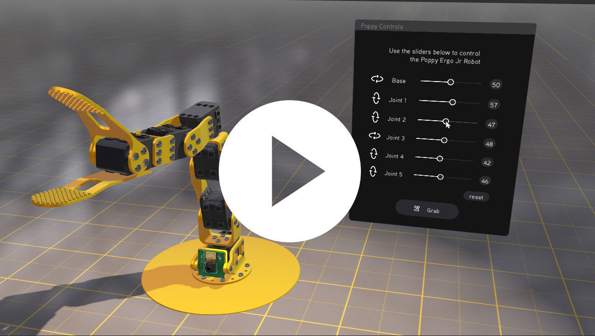
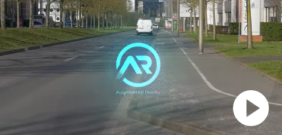
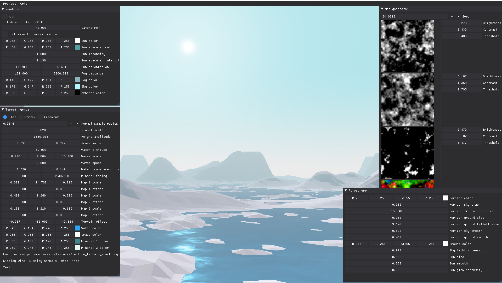
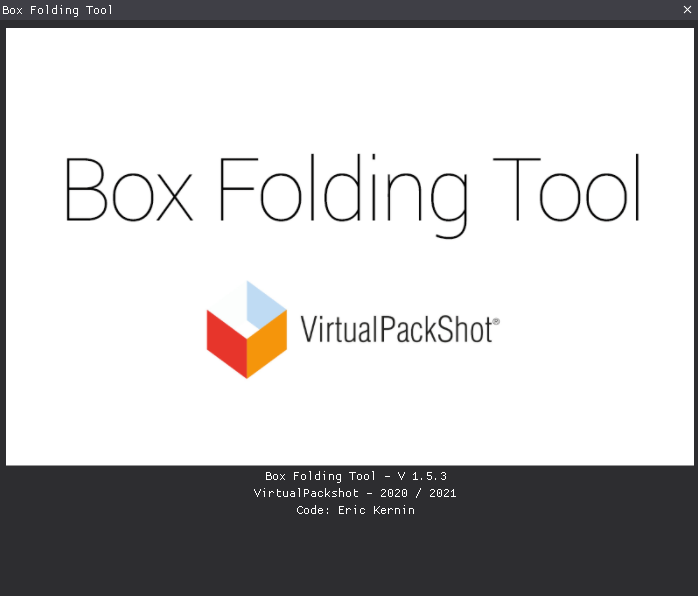
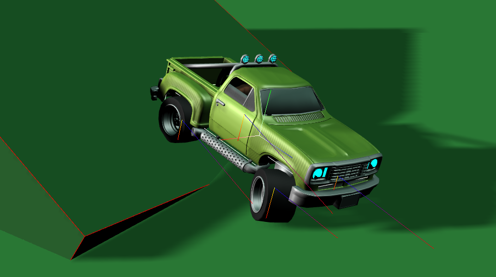
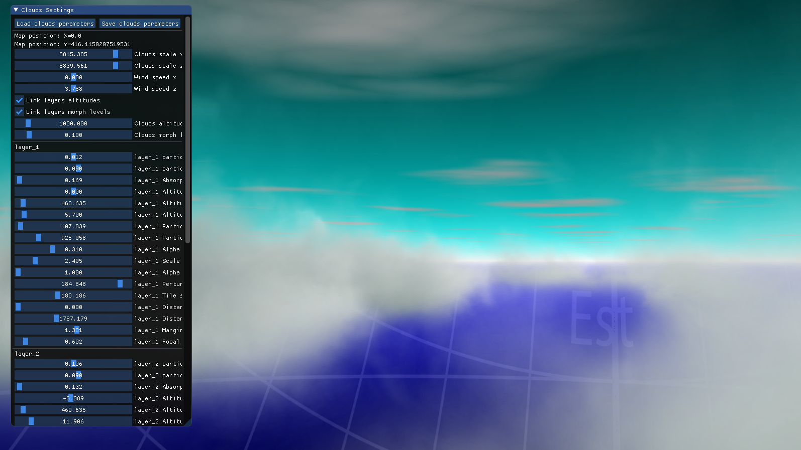
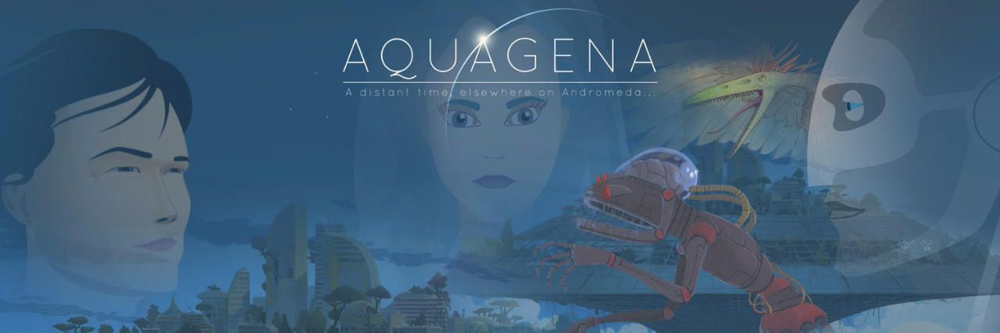
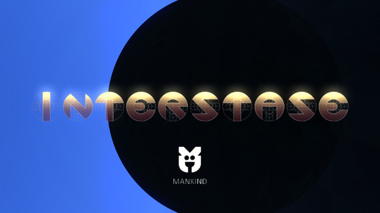

# Projects

You will find here a list of personal projects or projects in which I have participated.
___
## Dogfight sandbox
Aeronautic fight simulator  
Framework: HARFANG3D / Python / OpenVR / GLSL 
Role: Code, design, sfx, music 

This project started as a technical demonstration of the HARFANG framework in terms of game developement using the Python language. Made available on Github, it became an environment of choice for a couple of universities in China and Turkey that started to use is as a platform for deep learning research.

As the main developer of this platform, I had the opportunity to assist the team of engineers of the ITU (Istanbul Technical University), providing them with a dedicated network API to control the fighter aircrafts from their neural network.

  
[Github repository](https://github.com/harfang3d/dogfight-sandbox-hg2)  
[Paper](https://arxiv.org/abs/2210.07282)
___
## Harfang GUI
Direct mode GUI designed for 2D/3D/VR  
Framework : HARFANG3D / Python  
Role: Code

Inspired by DearImGui, using the same "immediate GUI paradigm", this library is 100% implemented in Python and powered by the HARFANG framework. The overall look and feel is based on the UX mockups provided by an interaction designer. The goal was to provide an almost pixel-perfect implementation of the original mockups designed in Adobe XD.

  
[Github repository](https://github.com/harfang3d/harfang-gui)
___
## Car HUD Integration  
HUD emmbeded system for VALEO  
Framework: HARFANF3D  
Role: Animated graphics integration  

Valeo builds a range of innovative Head-Up Display (HUD) systems showing information in the driver's field of vision, directly on the windshield. My role was to implement, in OpenGLES shaders, a pixel-perfect equivalent of the navigation and guidance symbols initially designed on Adobe After Effects.

  
[Project for VALEO](https://youtu.be/0tj9X0auug0)
___
## Terrain Generator - Fast rendering for VR projects  
Terrain editor for fast rendering VR project  
Framework: HARFANG3D / Python - GLSL  
Role: Code

As a part of a larger project, this terrain generator was implemented in Python. To deliver a good compromise between performance and aesthetic quality, the terrain is GPU-generated.

The low-polygon look was a deliberate choice, in accordance with the UX vision provided by the interaction designer.

  
___
## Box Folding Tool

A complete modelling solution for building 3D food packaging from printable PDF files. Implemented in Python, the software allows a non-destructive back-and-forth process, based on several steps, going from the 2D cutter guides found in the PDF file to the final export of a FBX/GLTF 3D model.

  
___
## Raycast car

A Python implementation of the classical _raycast car_ model, based on the HARFANG framework and Bullet Physics. Uses both forces and impulses to simulate the thrust, grip and steering of the vehicle.

  
___
## Volumetric Clouds - Fast billboards  

Implemented in Python and GLSL, using 3D textures, to render a procedural-generated layer of clouds in an open world.

  
___
## Aquagena

A project of independent game, implemented in Python, based on the HARFANG framework. Inspired by popular video game landmarks such as _Prince of Persia_ and _Another world_, this project involved a handfull of techniques, including:
- filming and rotoscoping of live animations for the main character
- design and modeling the 3D set in Blender
- implementation of a 2D animation tool
- implementation of the game system, including the character motion with physics constraints and interactions, among other things.

  
[Cinematic introduction](https://youtu.be/ykqFXRICylk)  
[Download playable demo](https://erickernin.itch.io/aquagena)
___
## Interstase

A _demoscene_ project presented at the Revision 2015 demoparty, in Saarbrücken, Germany. The _demoscene_ is an underground cultural movement, allowing digital artists to compete in various fields, such as coding, music or 3D modeling.

Interstase is a very personal project that allowed me to experiment with the implementation of a C++ 3D engine from the ground up. The project is based on scenes from Lightwave 3D, displayed by a scenarization system of my own. Part of the 3D rendering is generated in real-time raytracing using GPU shaders.

  
[Github repository](https://github.com/ErkMkd/Interstase)
